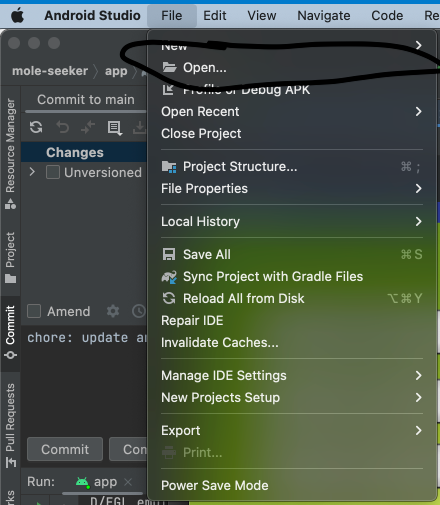
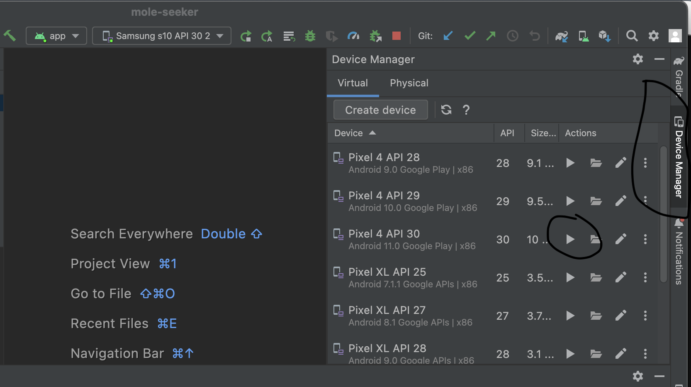
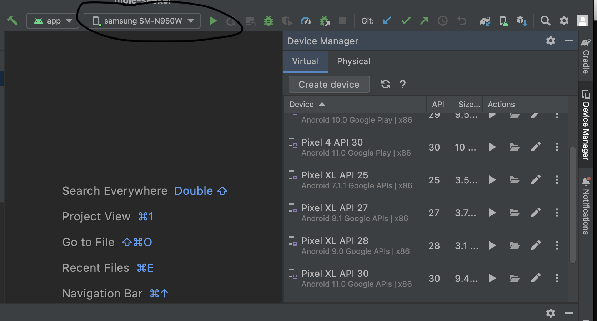

# Introduction
The goal of the project is to create an Android app that is used to track the locations of parents walking their kids to school with other parents as a group activity

## Tools
Development include using Android Studio for the frontend including all UI elements and and a custom backend server provided by the CMPT 276 instructor which exposes a RESTful API which the frontend can send requests to.

## Requirements

* Android Studio Electric Eel or newer

# How to setup Local Development

**Note: The API that Walking School Bus used to interact with is permanently down (taken down by the course instructor after the course was finished).  Thus, the app will be very buggy if run locally as many features will be unavailable.  Running the app locally should only be done with the purpose of viewing the UI elements.**

1. Clone the repo

```
git clone https://github.com/ksg604/walking-school-bus.git
``` 

2. Run Android Studio and open the folder you just cloned 



3. Select Build -> Make Project

4. Open the device manager on the right hand side of Android Studio



5. Choose one of the emulator devices to run the app by clicking the play button next to one of them

6. Select Run -> Run app on Android Studio

The app should run on the virtual device you have running.  

If you don't want to use an emulator, you can plug in a physical Android device to test Mole Seeker out.  If you are doing this, ensure USB debugging is enabled on your device.  Then, plug your device in while Android studio has the Mole Seeker project opened.  Ensure your device is selected to run the app and then choose Run -> Run app.



Mole Seeker should then be installed and run automatically on your device

